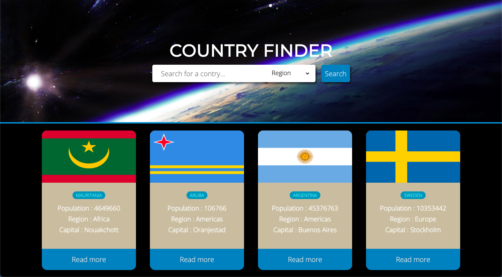
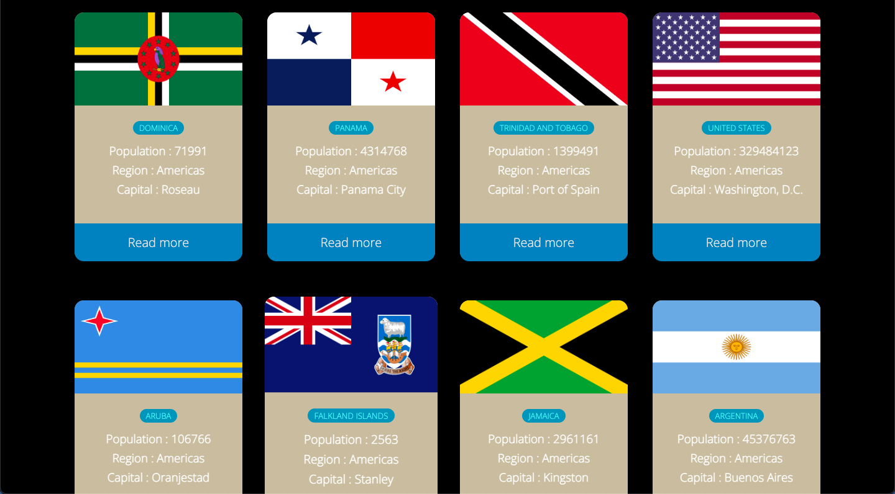
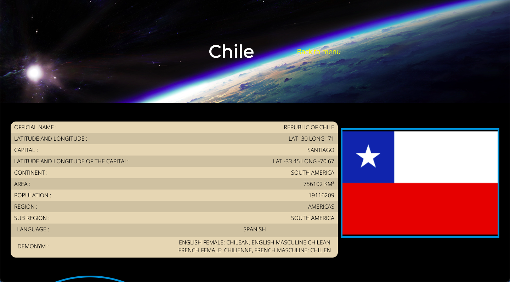
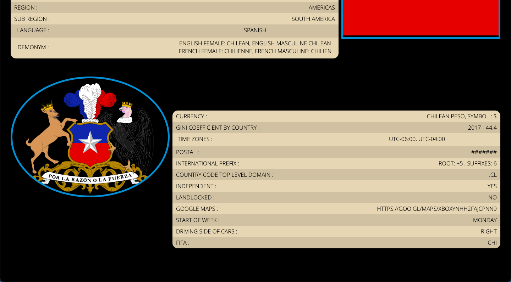

# Escalab-Prueba

Escalab- prueba is a country search engine where the user can search for the country they want or filter it by region. After the user chooses a country, the API will fetch all the data about the country, like; name, population, region, etc, after that the data will be display in another page where the user can see all information about the country.

The purpose of this page is to be able to demostrade the skills and knowledge that i have acquired plus the instructions that were indicated to me and thus be able to participate for the Escalab bootcamp and have a feedback from the company.

The page was created with only html, css and js vanilla, in addition to this was implemented a Google Fonts script was implemented to give the page a more personalized style.

## Get started

The first thing to do is open the project with the code editor of your choice and then once there, you have to run the project on the port 5500 in your local browser.

## UI

Html, Css, Vanilla Js

## API

The API that was implement in this project was Rest Coutries, that is a page that give all information about the countries around the world.

The link for make request is the following;
https://restcountries.com/#api-endpoints-v3-name
